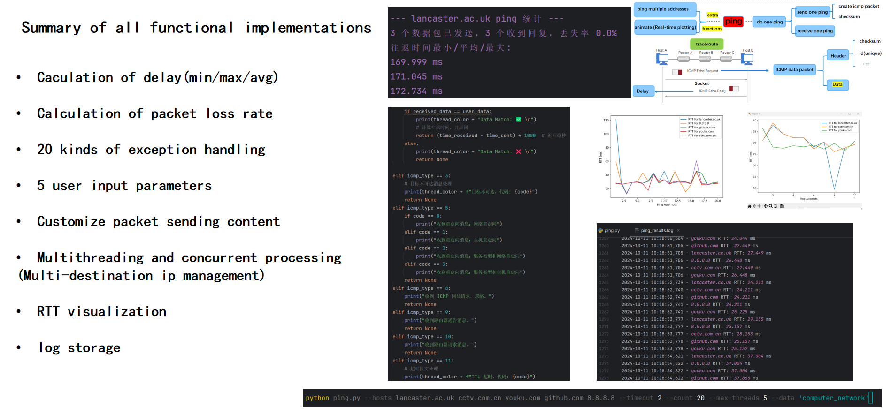
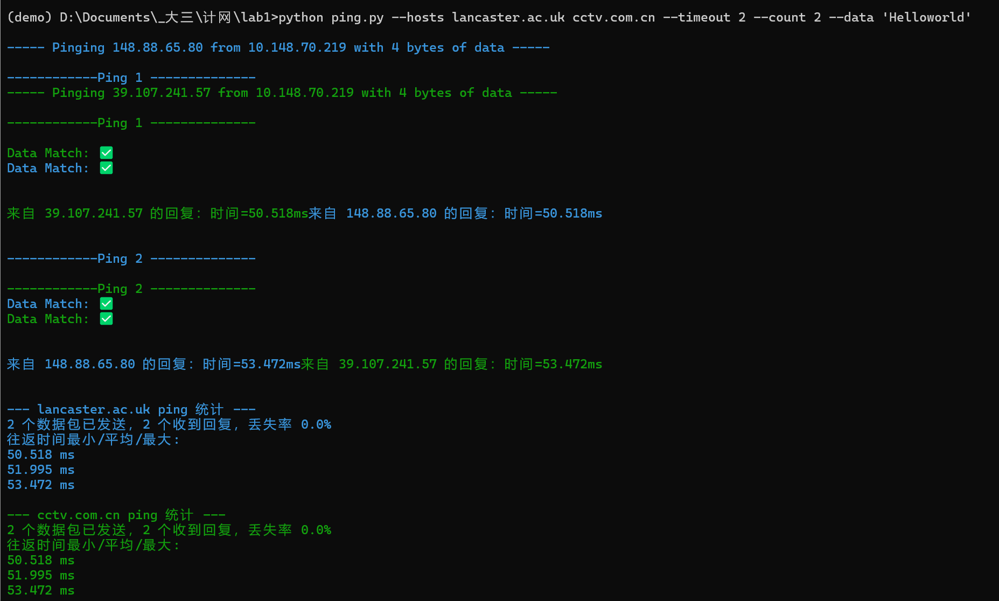
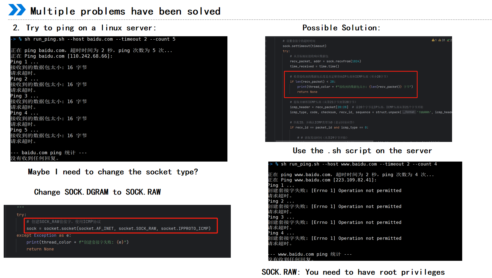

### Readme for Python ICMP Ping Tool with RTT Visualization

#### Introduction:
This Python script is an ICMP Ping tool designed to measure network latency (RTT, Round-Trip Time) by sending ICMP Echo Requests to one or more target hosts and displaying the results in real-time using a graphical plot. The tool supports concurrent pinging of multiple hosts, logging the results, and dynamically adjusting threads based on user input.



#### Features:
- **ICMP Ping**: Sends ICMP Echo Requests and receives Echo Replies from target hosts to measure network round-trip time (RTT).

- **Concurrent Pinging**: Allows for pinging multiple hosts simultaneously with adjustable thread control.

- **Logging**: Results of each ping, including RTT, are logged to a file.

- **Real-time Visualization**: Displays a real-time plot of the RTT values for all hosts.

- **Customizable**: Users can specify the number of pings, timeout, data payload, and maximum threads via command-line arguments.

- **Graceful Termination**: The pinging process is terminated if the visualization window is closed.

  

#### Command-line Arguments:
- `--hosts`: List of target hosts or IP addresses to ping (required).
- `--timeout`: Timeout for each ping in seconds (default: 1 second).
- `--count`: Number of pings to send to each host (default: 4).
- `--data`: Custom data string to be included in each ICMP Echo Request (default: "Ping").
- `--max-threads`: Maximum number of concurrent threads allowed (default: 5).

#### Core Concepts:
- **Ping**: The tool sends an ICMP Echo Request to a target and waits for an ICMP Echo Reply, measuring the time taken for the round trip (RTT).
- **RTT (Round-Trip Time)**: The total time it takes for the ICMP Echo Request to reach the target and for the reply to return.
- **TTL (Time-To-Live)**: The maximum time an IP packet is allowed to circulate on the network before being discarded. The tool handles TTL exceeded responses.
- **ICMP**: Internet Control Message Protocol, used for sending error messages and operational information like ping requests.

#### Code Flow and Logic:

1. **Initialization**:
   - The `colorama` library is used to output colored text for easy differentiation of threads.
   - The script initializes a log file (`ping_results.log`) to record the ping results.
   - Several global variables are used to manage state (e.g., `rtt_data` to store RTT values and `stop_flag` for stopping the process).

2. **Checksum Calculation**:
   - The `calculate_checksum()` function computes the ICMP checksum for data integrity verification.

3. **Creating and Sending ICMP Packets**:
   - `create_icmp_packet()` constructs an ICMP Echo Request packet, including a header and user data.
   - `send_one_ping()` sends this ICMP packet to the target host via a raw socket.

4. **Receiving and Parsing ICMP Packets**:
   - `receive_one_ping()` listens for an ICMP Echo Reply, extracts information such as the RTT, and verifies the packet's integrity.

5. **Executing Ping**:
   - `do_one_ping()` performs a single ping operation and returns the RTT.
   - `ping()` performs multiple pings to a host, logs the results, and stores the RTT values for real-time plotting. It also handles retries for failed pings.

6. **Concurrency and Thread Management**:
   - `ping_multiple_addresses()` manages concurrent pinging of multiple hosts using a thread pool with adjustable limits.
   - Each thread executes the `ping()` function for its assigned host.

7. **Real-time Visualization**:
   - `animate()` dynamically updates a plot showing the RTT for each host, using `matplotlib`.
   - The plot shows the RTT values over time, with the x-axis representing ping attempts.

8. **Graceful Termination**:
   - If the visualization window is closed, the `on_close()` function is triggered, setting the `stop_flag` to true, which stops the pinging process.

#### Example Usage:
```bash
python ping.py --hosts lancaster.ac.uk cctv.com.cn youku.com --timeout 2 --count 4 --max-threads 3 --data 'HelloWorld'
```

In this example:
- The script will ping the hosts `lancaster.ac.uk`, `cctv.com.cn`, and `youku.com` four times each, with a 2-second timeout for each ping.
- The custom data payload `"HelloWorld"` will be sent in each ICMP Echo Request.
- A maximum of 3 concurrent threads will be used to handle the pinging process.

#### Visualization:
The RTT for each target host will be plotted in real-time, with the x-axis showing the number of ping attempts and the y-axis displaying the RTT in milliseconds.


#### Logging:
Ping results are logged to `ping_results.log`, including RTT values for each successful ping.


#### Termination:
The script will terminate gracefully when the visualization window is closed, and all threads will stop executing.

At the same time we beautify the output of the terminal.



#### Requirements:
- Python 3.x
- Required libraries: `socket`, `struct`, `time`, `os`, `argparse`, `threading`, `colorama`, `matplotlib`, `queue`, `logging`

#### Known Limitations:
- ICMP packets require administrative (root) privileges to send. You may need to run the script with elevated privileges (e.g., using `sudo` on Linux).

  

#### Appendix:

Our presentation ppt has been released now, hope that our ppt can help you to complete the next tasks.
